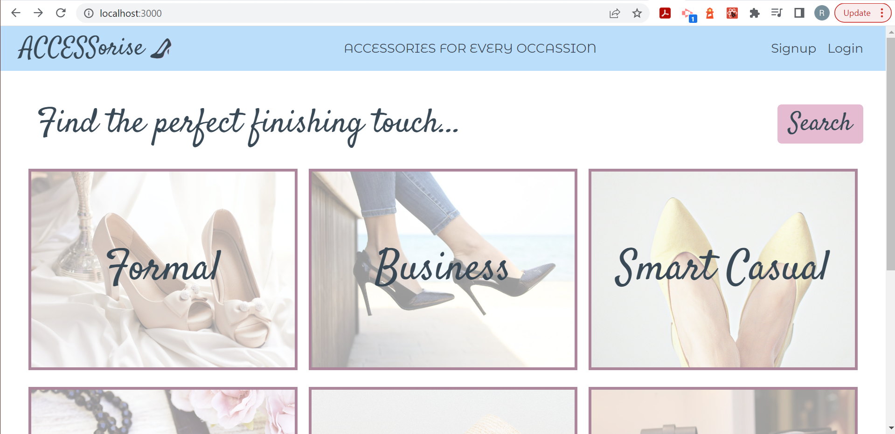

# ACCESSorise: Accessories Sharing App

## Description

ACCESSorise gives you ACCESS to a world of accessories at your fingertips - and all for free! Instead of buying a new pair of shoes or bag before a big event, why not check out your friends' accessory libraries and see if you can find something to borrow? Upload your own accessories and choose your preferred visibility - hiddden, visible only to friends, or visible to the general public - and get started sharing accessories today.

## Installation

N/A

## Usage

Once you've created an account, you'll have an option to add products. Fill in key product details and add an image (or many!). You can also browse accessories uploaded by other users, if they're set to public or you have them in your friends list. When you find an accessory that matches what you're looking for, click into the product page and press the 'Book' button to choose your booking date. You can also send a message to the owner if you have any questions.

Deployed URL: (https://accessorise.herokuapp.com/)

## Credits

The following resources were referenced to ensure best practice and adherence to appropriate conventions:

'Deploying a Create React App to GitHub' by Create React App: (https://create-react-app.dev/docs/deployment/#github-pages)

Google Fonts: (https://fonts.google.com/)

Create React App Documentation: (https://create-react-app.dev/docs/installing-a-dependency/)

JWT Documentation: (https://jwt.io/)

Tailwind CSS Documentation: (https://getbootstrap.com/docs/5.2/getting-started/introduction/)

Mongoose Documentation: (https://mongoosejs.com/docs/populate.html)

MongoDb Documentation: (https://www.mongodb.com/docs/manual/reference/operator/update/addToSet/)

Apollo GraphQl Sandbox: (https://studio.apollographql.com/sandbox/explorer)

Apollo GraphQL Documentation: (https://www.apollographql.com/docs/apollo-server/schema/schema/)

GraphQl Aliases Documentation: (https://graphql.org/learn/queries/#aliases)

Stock images via Pexels: (https://www.pexels.com/)

Stripe Payment Gateway Documentation: (https://stripe.com/docs)

HeroIcons Documentation: (https://github.com/tailwindlabs/heroicons)

Tailwing Forms Documentation: (https://github.com/tailwindlabs/tailwindcss-forms)

'How to use Custom Fonts in Tailwind CSS' by LogRocket (https://blog.logrocket.com/how-to-use-custom-fonts-tailwind-css/)

'Setting up Tailwind CSS in a React Project' by Smashing Magazine (https://www.smashingmagazine.com/2020/02/tailwindcss-react-project/)

'Deploy with Heroku and MongoDB Atlas' by The Full Stack Blog (https://coding-boot-camp.github.io/full-stack/mongodb/deploy-with-heroku-and-mongodb-atlas)

'Make tailwindcss modal dialog with scrolling content?' via Stack Overflow, answer by Mark Eric: (https://stackoverflow.com/questions/66839202/make-tailwindcss-modal-dialog-with-scrolling-content)

'Pushing Mongoose documents to another document as array elements' by freecodecamp.org: (https://forum.freecodecamp.org/t/pushing-mongoose-documents-to-another-document-as-array-elements/400067)

'Multiple populates - mongoosejs' via Stack Overflow, answer by Matthew Wolman: (https://stackoverflow.com/questions/12821596/multiple-populates-mongoosejs)

'How to download a local file in Reactjs via Stack Overflow', answer by Belhadjer Samir: (https://stackoverflow.com/questions/66198311/how-to-download-a-local-file-in-reactjs)

Icons for technology proficiencies gif via Simple Icons: (https://simpleicons.org/)

'How to Set a Background Image in React From Your /src Folder' by Free Code Camp: (https://www.freecodecamp.org/news/react-background-image-tutorial-how-to-set-backgroundimage-with-inline-css-style/)

Common js functions and parameters, for loops and arrays: JS CheatSheet by HTML CheatSheet (https://htmlcheatsheet.com/js/)

## License

Licensed under the standard MIT license. Please refer to the license in the repo for more information.
